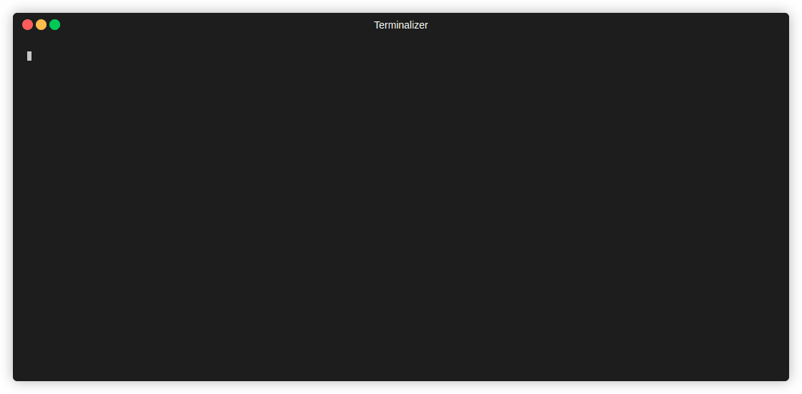
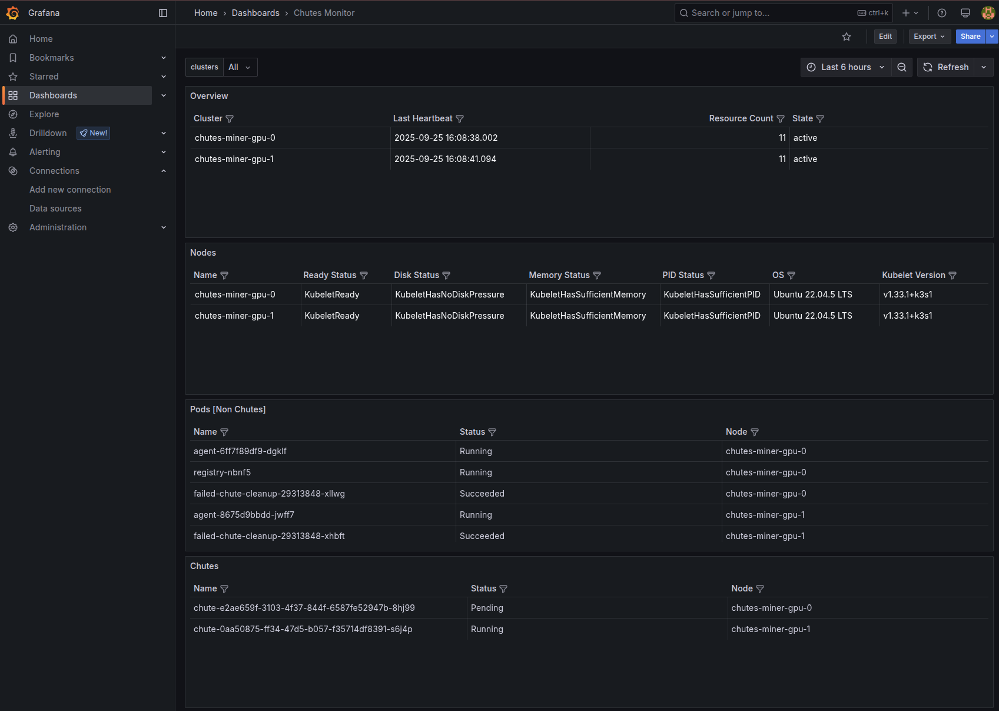

# Chutes miner

This repository contains all components related to mining on the chutes.ai permissionless, serverless, AI-centric compute platform.

We've tried to automate the bulk of the process via ansible, helm/kubernetes, so while it may seem like a lot, it should be fairly easy to get started.

## 📋 Table of Contents

- [Chutes Miner](#chutes-miner)
- [TL;DR](#%EF%B8%8F-tldr)
- [Component Overview](#%EF%B8%8F-component-overview)
  - [Provisioning/Management Tools](#%EF%B8%8F-provisioningmanagement-tools)
    - [Ansible](#%EF%B8%8F-ansible)
    - [Kubernetes](#%EF%B8%8F-kubernetes)
  - [Miner Components](#%EF%B8%8F-miner-components)
    - [Postgres](#%EF%B8%8F-postgres)
    - [Redis](#%EF%B8%8F-redis)
    - [GraVal Bootstrap](#%EF%B8%8F-graval-bootstrap)
    - [Registry Proxy](#%EF%B8%8F-registry-proxy)
    - [API](#%EF%B8%8F-api)
    - [Gepetto](#%EF%B8%8F-gepetto)
- [Getting Started](#%EF%B8%8F-getting-started)
  - [1. Use Ansible to Provision Servers](#1-use-ansible-to-provision-servers)
    - [Important RAM Note](#important-ram-note)
    - [Important Storage Note](#important-storage-note)
    - [Important Networking Note](#important-networking-note)
  - [2. Configure Prerequisites](#2-configure-prerequisites)
    - [Local Configuration](#local-configuration)
    - [Define Your Inventory](#define-your-inventory)
    - [Set Your Values](#set-your-values)
    - [Kubernetes CLI](#kubernetes-cli)
    - [Dockerhub Login](#dockerhub-login)
    - [Miner Credentials](#miner-credentials)
  - [3. Chart Configuration](#3-chart-configuration)
    - [Chutes Miner](#chutes-miner)
    - [Chutes Miner GPU](#chutes-miner-gpu)
  - [4. Setup Your Infrastructure](#4-setup-your-infrastructure)
  - [5. Update Gepetto with Your Optimized Strategy](#5-update-gepetto-with-your-optimized-strategy)
  - [6. Post Install](#6-post-install)
  - [7. Register](#7-register)
  - [8. Add Your GPU Nodes to Inventory](#8-add-your-gpu-nodes-to-inventory)
- [Adding Servers](#%EF%B8%8F-adding-servers)
- [Cluster Management Utilities](#%EF%B8%8F-cluster-management-utilities)
  - [ktx (Kube Context Switcher)](#ktx-kube-context-switcher)
  - [kns (Kube Namespace Switcher)](#kns-kube-namespace-switcher)
  - [Grafana](#grafana)
- [Troubleshooting](#troubleshooting)
  - [Postgres](#postgres)

## ⛏️ TL;DR

The goal of mining on chutes is to provide as much compute as possible, optimizing for cold start times (running new applications or applications that have been preempted). Everything is automated with kubernetes, and coordinated by the `gepetto.py` script to optimize for cost efficiency and maximize your share of compute.

Incentives are based on total compute time (including bounties given from being first to provide inference on code app).

You should probably run a wide variety of GPUs, from very cheap (a10, a5000, t4, etc.) to very powerful (8x h100 nodes).

Never register more than one UID, since it will just reduce your total compute time and you'll compete with yourself pointlessly.  Just add capacity to one miner.

Incentives/weights are calculated from 7 day sum of compute, so be patient when you start mining.  We want high quality, stable miners in it for the long haul!

## 🔍 Component Overview

### 🛠️ Provisioning/management tools

#### 🤖 Ansible

While not strictly necessary, we *highly* encourage all miners to use our provided [ansible](https://github.com/ansible/ansible) scripts to provision servers.
There are many nuances and requirements that are quite difficult to setup manually.

*More information on using the ansible scripts in subsequent sections.*

#### ☸️ Kubernetes

The entirety of the chutes miner must run within a [kubernetes](https://kubernetes.io/). While not strictly necessary, we recommend using k3s (which is all handled automatically from the ansible scripts).
If you choose to not use k3s, you must also modify or not use the provided ansible scripts.

*__this is installed and configured automatically by ansible scripts__*

### 🧩 Miner Components

*There are many components and moving parts to the system, so before you do anything, please familiarize yourself with each!*

#### 🐘 Postgres

We make heavy use of SQLAlchemy/postgres throughout chutes.  All servers, GPUs, deployments, etc., are tracked in postgresql which is deployed with a host volume within your kubernetes cluster.

*__this is installed and configured automatically when deploying via helm charts__*

#### 🔄 Redis

Redis is primarily used for it's pubsub functionality within the miner.  Events (new chute added to validator, GPU added to the system, chute removed, etc.) trigger pubsub messages within redis, which trigger the various event handlers in code.

*__this is installed and configured automatically when deploying via helm charts__*

#### ✅ GraVal bootstrap

Chutes uses a custom c/CUDA library for validating graphics cards: https://github.com/rayonlabs/graval

The TL;DR is that it uses matrix multiplications seeded by device info to verify the authenticity of a GPU, including VRAM capacity tests (95% of total VRAM must be available for matrix multiplications).
All traffic sent to instances on chutes network are encrypted with keys that can only be decrypted by the GPU advertised.

When you add a new node to your kubernetes cluster, each GPU on the server must be verified with the GraVal package, so a bootstrap server is deployed to accomplish this (automatically, no need to fret).

Each time a chute starts/gets deployed, it also needs to run GraVal to calculate the decryption key that will be necessary for the GPU(s) the chute is deployed on.

*__this is done automatically__*

#### 🔀 Registry proxy

In order to keep the chute docker images somewhat private (since not all images are public), we employ a registry proxy on each miner that injects authentication via bittensor key signature.

Each docker image appears to kubelet as `[validator hotkey ss58].localregistry.chutes.ai:30500/[image username]/[image name]:[image tag]`

This subdomain points to 127.0.0.1 so it always loads from the registry service proxy on each GPU server via NodePort routing and local first k8s service traffic policy.

The registry proxy itself is an nginx server that performs an auth subrequest to the miner API.  See the nginx configmap: https://github.com/rayonlabs/chutes-miner/blob/main/charts/templates/registry-cm.yaml

The miner API code that injects the signatures is here: https://github.com/rayonlabs/chutes-miner/blob/main/api/registry/router.py

Nginx then proxies the request upstream back to the validator in question (based on the hotkey as part of the subdomain), which validates the signatures and replaces those headers with basic auth that can be used with our self-hosted registry: https://github.com/rayonlabs/chutes-api/blob/main/api/registry/router.py

*__this is installed and configured automatically when deploying via helm charts__*

#### ⚡ API

Each miner runs an API service, which does a variety of things including:
- server/inventory management
- websocket connection to the validator API
- docker image registry authentication

*__this is installed and configured automatically when deploying via helm charts__*

#### 🧙‍♂️ Gepetto

Gepetto is the key component responsible for all chute (aka app) management. Among other things, it is responsible for actually provisioning chutes, scaling up/down chutes, attempting to claim bounties, etc.

This is the main thing to optimize as a miner!

## 🚀 Getting Started

### 1. Server Setup

Sections 2 and 3 walk through configuration and using ansible to provision your servers/kubernetes.

ALL servers must be bare metal/VM, meaning it will not work on Runpod, Vast, etc., and we do not currently support shared or dynamic IPs - the IPs must be unique, static, and provide a 1:1 port mapping.

### Important RAM note!

It is very important to have as much RAM (or very close to it) per GPU as VRAM.  This means, for example, if you are using a server with 4x a40 GPUs (48GB VRAM), the server must have >= 48 * 4 = 192 GB of RAM!  If you do not have at least as much RAM per GPU as VRAM, deployments are likely to fail and your servers will not be properly utilized.

#### Important storage note!

Some providers mount the primary storage in inconvenient ways, e.g. latitude.sh when using raid 1 mounts the volume on `/home`, hyperstack mounts under `/ephemeral`, etc.  Before running the ansible scripts, be sure to login to your servers and check how the storage is allocated.  If you want storage space for huggingface cache, images, etc., you'll want to be sure as much as possible is allocated under `/var/snap`.
You can do this with a simple bind mount, e.g. if the main storage is under `/home`, run:
```bash
rsync -azv /var/snap/ /home/snap/
echo '/home/snap /var/snap none bind 0 0' >> /etc/fstab
mount -a
```

#### Important networking note!

Before starting, you must either disable all layers of firewalls (if you like to live dangerously), or enable the following:
- allow all traffic (all ports, all protos inc. UDP) between all nodes in your inventory
- allow the kubernetes ephemeral port range on all of your GPU nodes, since the ports for chute deployments will be random, in that range, and need public accessibility - the default port range is 30000-32767
- allow access to the various nodePort values in your API from whatever machine you are managing/running chutes-miner add-node/etc., or just make it public (particularly import is the API node port, which defaults to 32000)

You'll need one non-GPU server (4 cores, 32gb ram minimum) responsible for running k3s, postgres, redis, gepetto, and API components (not chutes), and __*ALL*__ of the GPU servers 😄 (just kidding of course, you can use as many or as few as you wish)

[The list of supported GPUs can be found here](https://github.com/rayonlabs/chutes-api/blob/main/api/gpu.py)


### 2. Configure prerequisites

#### Local Configuration

Keep your local configuration separate from the repository.  This ensures updates don't cause conflicts when pulling the latest code.

1. Ansible configuration
```bash 
mkdir ~/chutes
touch ~/chutes/inventory.yml
```
Copy the default configuration from `ansible/k3s/inventory.yml` and put it in this file to update the placeholder values.

2. Chart configuration
```bash
mkdir ~/chutes
touch ~/chutes/values.yaml
```

### Define your inventory

Using your favorite text editor (vim of course), edit your local inventory.yml to suite your needs.

For example:
```yaml

all:
  children:
    # This would be the main node, which runs postgres, redis, gepetto, etc.
    control:
      hosts:
        chutes-miner-cpu-0:
          ansible_host: 1.0.0.0
    workers:
      hosts:
        chutes-miner-gpu-0:
          ansible_host: 1.0.0.1
        chutes-miner-gpu-1:
          ansible_host: 1.0.0.2
          ansible_user: different_user
          ansible_ssh_private_key_file: ~/.ssh/other_key.pem
  vars:
    ansible_user: ubuntu
    ansible_ssh_private_key_file: ~/.ssh/key.pem
    ssh_keys:
      - "ssh-rsa AAAAB... user@domain.com"
    # The username you want to use to login to those machines (and your public key will be added to).
    user: billybob

    hotkey_path: "~/.bittensor/wallets/[WALLET]/hotkeys/[HOTKEY]"

    chart_values: "~/chutes/values.yaml"

    grafana_password: <REPLACE_ME>
```

### Set your values

In most cases the default values will work fine.  Values are explained in detail in the [Chart Configuration](#3-chart-configuration) section. If you find you need to customize and chart values just update your local values file, i.e. `~/chutes/values.yaml`

```yaml
cache:
  overrides:
# Add any per-node cache size (in GB) overrides here, e.g.:
#    chutes-miner-gpu-0: 1000
#    chutes-miner-gpu-1: 1500
```


#### Kubernetes CLI

Each node keeps its authoritative kubeconfig at `/etc/rancher/k3s/k3s.yaml`. Ansible now executes all Kubernetes actions directly on the node using that file, which avoids merging kubeconfigs or copying credentials around.

If you want to interact with the clusters from your laptop or another machine:

- install [kubectl](https://kubernetes.io/docs/reference/kubectl/)
- either copy the kubeconfig from any node (e.g. `scp user@node:/etc/rancher/k3s/k3s.yaml ~/.kube/<node>.yaml`) or use the `chutes-miner-cli sync-kubeconfig` command, which calls the `/servers/kubeconfig` API endpoint to assemble a read-only merged config
- export `KUBECONFIG` (or pass `--kubeconfig`) when running `kubectl`

#### Miner credentials

In order to authenticate with the valiadtor you need to supply the miner credentials via a k8s secret.  This secret can be automatically created by ansible but you need the wallet first.

Here's an example using a throwaway key.  Suppose you created a hotkey as such:
```bash
$ btcli wallet new_hotkey --wallet.name offline --wallet.hotkey test --wallet.path ~/.bittensor/wallets
...
```

Then set the path to the hotkey in your local inventory, i.e. `~/chutes/inventory.yml`.  Ansible will parse and the hotkey and provide values via environment so the hotkey is not exposed on nodes.
```yaml
    hotkey_path: ~/bittensor/wallets/offline/hotkey/test
```

### 3. Chart Configuration

The chutes components are split into separate sets of charts to support standalone clusters.

The [chutes-miner](charts/chutes-miner/) charts contain the templates for the chutes miner API and associated components.

The [chutes-miner-gpu](charts/chutes-miner-gpu/) charts contain the templates for the chutes miner components specifically used by GPU nodes.

The [chutes-monitoring](charts/chutes-monitoring/) charts contain templates for the monitoring components, including metric federation from member clusters to the central karmada prometheus instance.  The monitoring charts and values are automatically generated and deployed by ansible.

Be sure to thoroughly examine the values for each set of charts and update according to your particular environment.  Apply any overrides to your custom values file (`~/chutes/values.yaml`) as described in [Section 2](#2-configure-prerequisites)

Primary sections to update:

### Chutes Miner

#### a. validators

Unlike most subnets, the validators list for chutes must be explicitly configured rather than relying on the metagraph.
Due to the extreme complexity and high expense of operating a validator on this subnet, we're hoping most validators will opt to use the child hotkey functionality rather that operating their own validators.

To that end, any validators you wish to support MUST be configured in the top-level validators section:

The default mainnet configuration is:
```yaml
validators:
  defaultRegistry: registry.chutes.ai
  defaultApi: https://api.chutes.ai
  supported:
    - hotkey: 5Dt7HZ7Zpw4DppPxFM7Ke3Cm7sDAWhsZXmM5ZAmE7dSVJbcQ
      registry: registry.chutes.ai
      api: https://api.chutes.ai
      socket: wss://ws.chutes.ai
```

#### b. huggingface model cache

To enable faster cold-starts, the kubernetes deployments use a hostPath mount for caching huggingface models.  The default is set to purge anything over 7 days old, when > 500gb has been consumed:
```yaml
cache:
  max_age_days: 30
  max_size_gb: 850
  overrides:
```

You can override per-node settings with the overrides block there, e.g.:
```yaml
cache:
  max_age_days: 30
  max_size_gb: 850
  overrides:
    node-0: 5000
```
In this example, the default will be 850GB, and node-0 will have 5TB.

If you have lots and lots of storage space, you may want to increase this or otherwise change defaults.

#### c. minerApi

The defaults should do fairly nicely here, but you may want to tweak the service, namely nodePort, if you want to change ports.
```yaml
minerApi:
  ...
  service:
    nodePort: 32000
    ...
```

#### d. other

Feel free to adjust redis/postgres/etc. as you wish, but probably not necessary.

#### e. multiCluster

This flag exists to allow backwards compatibility with the old microk8s setup.  If you have not migrated and need to update using the new charts set this flag to false in your values.

### Chutes Miner GPU

The default values should be fine here.

#### a. multiCluster

This flag exists to allow backwards compatibility with the old microk8s setup.  If you have not migrated and need to update using the new charts set this flag to false in your values.

### 4. Setup your infrastructure

Now that all the configuration is setup, use ansible to setup your infrastructure using the [guide](ansible/k3s/README.md). Once you have your nodes deployed come back here to finish setup.

### 5. Update gepetto with your optimized strategy

Gepetto is the most important component as a miner.  It is responsible for selecting chutes to deploy, scale up, scale down, delete, etc.
You'll want to thoroughly examine this code and make any changes that you think would gain you more total compute time.

Once you are satisfied with the state of the `gepetto.py` file, you'll need to create a configmap object in kubernetes that stores your file (from inside the `src/chutes-miner/chutes_miner` directory in the repo):
```bash
kubectl create configmap gepetto-code --context chutes-miner-cpu-0 --from-file=gepetto.py -n chutes
```

Any time you wish to make further changes to gepetto, you need to re-create the configmap:
```bash
kubectl create configmap gepetto-code --from-file=gepetto.py -o yaml --dry-run=client | kubectl apply --context chutes-miner-cpu-0 -n chutes -f -
```

You must also restart the gepetto deployment after you make changes, but this will only work AFTER you have completed the rest of the setup guide (no need to run when you initially setup your miner):
```
kubectl rollout restart deployment/gepetto --context chutes-miner-cpu-0 -n chutes
```

### 6. Post Install

#### Dockerhub login (Optional)

- Create a docker hub login to avoid getting rate-limited on pulling public images (you may not need this at all, but it can't hurt):
  - Head over to https://hub.docker.com/ and sign up, generate a new personal access token for public read-only access, then create the secret:

```bash
# Create secret for the context
kubectl create secret docker-registry regcred --context chutes-miner-cpu-0 --docker-server=docker.io --docker-username=[replace with your username] --docker-password=[replace with your access token] --docker-email=[replace with your email]
```

### 7. Register

Register as a miner on subnet 64.
```bash
btcli subnet register --netuid 64 --wallet.name [COLDKEY] --wallet.hotkey [HOTKEY]
```

You __*should not*__ announce an axon here!  All communications are done via client-side initialized socket.io connections so public axons serve no purpose and are just a security risk.


### 8. Add your GPU nodes to inventory

The last step in enabling a GPU node in your miner is to use the `add-node` command in the `chutes-miner` CLI.  This calls the miner API, triggers spinning up graval validation services, etc.  This must be run exactly once for each GPU node in order for them to be usable by your miner.

Make sure you install `chutes-miner-cli` package (you can do this on the CPU node, your laptop, wherever):
```bash
pip install chutes-miner-cli
```

**__This is installed automatically on the control node__**

Run this for each GPU node in your inventory:
```bash
chutes-miner add-node \
  --name [SERVER NAME FROM inventory.yaml] \
  --validator [VALIDATOR HOTKEY] \
  --hourly-cost [HOURLY COST] \
  --gpu-short-ref [GPU SHORT IDENTIFIER] \
  --hotkey [~/.bittensor/wallets/[COLDKEY]/hotkeys/[HOTKEY] \
  --agent-api http://[NODE_IP]:32000 \
  --miner-api http://[MINER API SERVER IP]:[MINER API PORT]
```

- `--name` here corresponds to the short name in your ansible inventory.yaml file, it is not the entire FQDN.
- `--validator` is the hotkey ss58 address of the validator that this server will be allocated to
- `--hourly-cost` is how much you are paying hourly per GPU on this server; part of the optimization strategy in gepetto is to minimize cost when selecting servers to deploy chutes on
- `--gpu-short-ref` is a short identifier string for the type of GPU on the server, e.g. `a6000`, `l40s`, `h100_sxm`, etc.  The list of supported GPUs can be found [here](https://github.com/rayonlabs/chutes-api/blob/main/api/gpu.py)
- `--hotkey` is the path to the hotkey file you registered with, used to sign requests to be able to manage inventory on your system via the miner API
- `--agent-api` is the URL for the agent running on the GPU node.  This is just the public IP of the node on port 32000.
- `--miner-api` is the base URL to your miner API service, which will be http://[non-GPU node IP]:[minerAPI port, default 32000], i.e. find the public/external IP address of your CPU-only node, and whatever port you configured for the API service (which is 32000 if you didn't change the default).

## ➕ Adding servers

You can add additional GPU nodes at any time by simply updating inventory.yaml and running the `site.yaml` playbook with the tag `add-nodes`: [ansible readme](/ansible/karmada/README.md#to-add-a-new-node-after-the-fact)

This will ensure only the new node is configured, and the necessary monitoring/kubectl configuration is updated for the control plane.

Once you have run ansible to setup the node, run the `chutes-miner add-node ...` command above.

## 🔧 Cluster Management Utilities

The playbook installs additional utilities to simplify multi-cluster operations:

**ktx (Kube Context Switcher):**

- Installed on control nodes from: `https://raw.githubusercontent.com/blendle/kns/master/bin/ktx`
- Quickly switch between kubernetes contexts
- Usage: `ktx` to list and select contexts interactively

**kns (Kube Namespace Switcher):**

- Installed on all nodes from: `https://raw.githubusercontent.com/blendle/kns/master/bin/kns`
- Quickly switch between kubernetes namespaces
- Usage: `kns` to list and select namespaces interactively
- Requires `fzf` (automatically installed)

### Available Contexts After Migration

```bash
# List available contexts
kubectl config get-contexts

# Contexts available:
# - chutes-miner-cpu-0 (control plane K3s cluster)
# - chutes-miner-gpu-X (Chutes GPU cluster contexts)
```

**Grafana**

Because nodes run as standalone clusters Grafana provides a default dashboard for visibility.  But you can always build out your own dashboards.

You can access grafana via nodePort or kubefwd if using local kubectl:
1. Navigate to http://[CONTROL_NODE_IP]:30080
2. Use kubefwd
    1. Forward the grafana service
        ```bash
        kubectl port-forward svc/monitoring-grafana -n monitoring 8080:80
        ```
    2. Navagate to http://localhost:8080




## Troubleshooting

### Postgres


| Issue | Symptoms | Solution |
|-------|----------|----------|
| **Authentication/Password** | Pods reporting authnetication failure to postgres | 1. The charts automatically check for an existing secret for the PG password.  If it does not exist it is created.<br>2. If postgres was previously deployed on this node, or the secret was manually deleted clear the postgres data volume from the host at `/var/snap/postgres-data` |